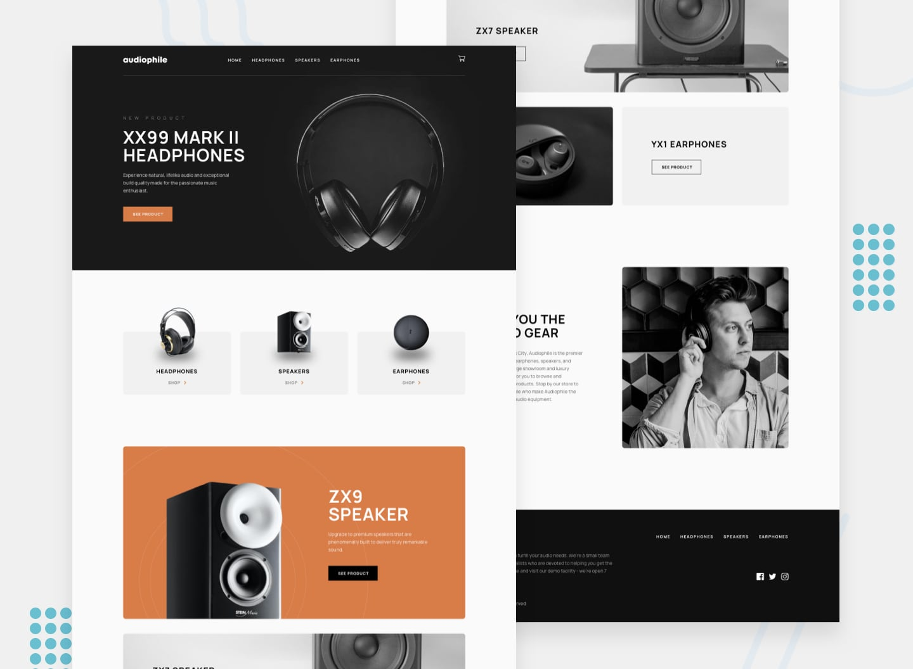

# 👨‍💻‍ Sobre o projeto

Audiophile é a página de uma empresa fictícia focada em produtos de áudio, incluindo fones de ouvido,
earphones, caixas de som e acessórios.
A [ideia do design](https://www.frontendmentor.io/challenges/audiophile-ecommerce-website-C8cuSd_wx)
veio de um desafio do frontend mentor.



## 💿 Como rodar na sua máquina

### Pré-requisitos

- **Git**;
- **Node + NPM**;

```shell
# Clone o repositório na sua máquina
$ git clone https://github.com/lleonardus/audiophile

# Abra a pasta do projeto
$ cd audiophile

# Instale as dependências
$ npm i

# Inicie o projeto
$ npm run dev
```

Após esse processo, o App vai estar rodando em **http://localhost:5173**

### 🧰 Ferramentas Utilizadas

- [Vite](https://vitejs.dev/)
- [TypeScript](https://www.typescriptlang.org/)
- [React](https://react.dev/)
- [React Router](https://reactrouter.com/en/main)
- [React Hot Toast](https://react-hot-toast.com/)
- [Tailwind](https://tailwindcss.com/)
- [NPM](https://docs.npmjs.com/downloading-and-installing-node-js-and-npm)
